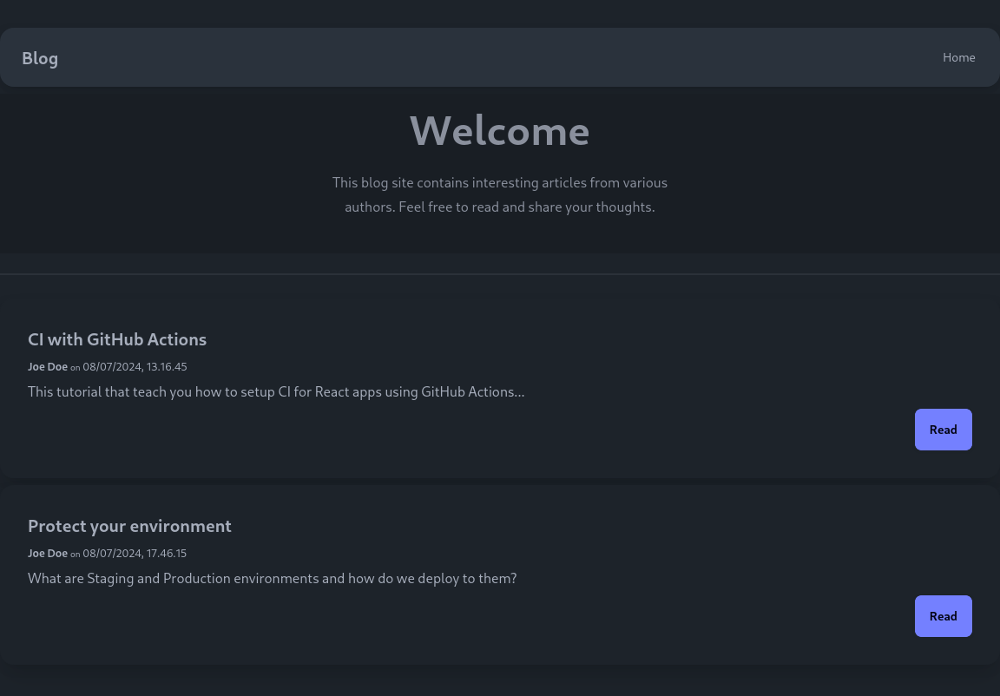

# React Docker Tutorial

In this tutorial you will learn how to containerize a React app using
multi-stage build.

## Getting started

1. Click on the green "Use this template" button at the top
2. Then select "Create a new repository"
3. Click "Create repository from template"
4. Type a repository name and click "Create Repository"
5. Clone the repository following the instructions [here](https://docs.github.com/en/repositories/creating-and-managing-repositories/cloning-a-repository)
6. Open your local clone in WebStorm or another editor

## Running without docker

Before we get started, let's run the app directly without docker.
Just so you can see what it is supposed to look like.

```sh
npm clean-install
npm run dev
```

Open the local url in a web browser.
You should see something like the screenshot.



## Build stage

### Copy files

Create a `Dockerfile` in the root of repository with following content:

```Dockerfile
FROM node:22-alpine
WORKDIR /app
# Copy the content of the current directory
COPY . .
```

Build the image with:

```sh
docker build -t react-app .
```

| Argument       | Description                                                   |
| -------------- | ------------------------------------------------------------- |
| `-t react-app` | Tag(/name) the build image "react-app"                        |
| `.`            | You have to supply the directory containing your `Dockerfile` |

Check the size with:

```sh
docker image ls | grep react-app
```

Yikes, over 250MB 😧!

Check the size of the base image:

```sh
docker pull node:22-alpine
docker image ls | grep -e "node *22-alpine"
docker image rm node:22-alpine
```

That is like 100MB less.
Certainly the source code for our simple demo app doesn't take up that much space.
So, what is going on?

### Debug size issue

You can run a shell in a container image with:

```sh
docker run -it --rm react-app sh
```

Try it!
Then type `ls -a` to list all files in current folder.
Which is `/app` because you've set `WORKDIR /app` in the Dockerfile.

Notice that `node_modules` is included in the output?
You've installed dependencies when you ran it directly.
Those dependencies got copied into the source code.

Type `exit` or hit <kbd>Ctrl</kbd>+<kbd>d</kbd> to exit the container.

This can be fixed by adding a `.dockerignore` file to root of repository with
the paths you want to ignore.
Create a `.dockerignore` file with the following content:

```.dockerignore
node_modules/
dist/
.git/
.env
docs
```

It tells docker build to ignore the listed file patterns when copying files.
It is very similar to `.gitignore` for Git.

Now, try to build again and check the size:

```sh
docker build -t react-app .
docker image ls | grep react-app
```

Now, that's a lot better.
Just including some source code shouldn't add much in size compared to the base
image (unless your project is gigantic).

### Install dependencies

That was a bit of a detour.
To get back on track, we need to install dependencies before we can build.

Replace the content of `Dockerfile` with:

```Dockerfile
# Stage 1: Build the React app
FROM node:22-alpine AS build
WORKDIR /app

# Copy package.json and package-lock.json
COPY package*.json ./

# Install dependencies
RUN npm clean-install
```

Each instruction (FROM, WORKDIR, COPY, RUN etc) in a Dockerfile creates new
layer.
All the layers combined makes up the final image.
Docker caches the layers and reuse layers from the cache when applicable.
This helps to speed up the build process.
If any of the instructions or any of the files you copy into the images changes
then the cached layer is discarded.

We can take advantage of the caching by only copying `package.json` and
`package-lock.json` (using
[glob](<https://en.wikipedia.org/wiki/Glob_(programming)>) pattern) before
installing dependencies.
That way `RUN npm clean-install` only happens again when the dependencies
change, regardless of changes to any of the source code.

Read more about [Docker build cache](https://docs.docker.com/build/cache/).

### Build the app

Append the following to `Dockerfile`:

```Dockerfile
# Copy the rest of the application source code
COPY . .

# Build the React application
RUN npm run build
```

If any of the source code change it will invalidate the cache for `COPY . .` layer.
The copy instruction and all following instruction will be run again.

Notice that we have `as build` at the end of `FROM node:22-alpine as build`.
It allows us to refer to this staged from another stage.

Try it out by building with:

```sh
docker build -t react-app .
```

Then add a line-break somewhere in `src/App.tsx` and build again.
The output shows what layers have been reused from cache.

```text
 => CACHED [2/6] WORKDIR /app             0.0s
 => CACHED [3/6] COPY package*.json ./    0.0s
 => CACHED [4/6] RUN npm clean-install    0.0s
 => [5/6] COPY . .                        1.4s
 => [6/6] RUN npm run build               7.0s
```

## Serve stage

For this we will use `nginx:alpine` as the base image.
By default, it serves files from `/usr/share/nginx/html`.
So that is where we will copy the output from `npm run build` to.
We can copy files from a previous stage with `--from=` argument followed by
name of the stage.

We also expose port 80 (default HTTP port) and set a command to start nginx.

Append this to your `Dockerfile`:

```Dockerfile
# Stage 2: Serve the React app using nginx
FROM nginx:alpine
# Copy the build output from the first stage to nginx's html directory
COPY --from=build /app/dist /usr/share/nginx/html
# Expose port 80
EXPOSE 80
# Start nginx
CMD ["nginx", "-g", "daemon off;"]
```

Build the container with:

```sh
docker build -t react-app .
```

The tag `react-app` is now going to refer to the resulting image from the serve
stage.
The resulting image contains (in addition to base image) only the output from
`npm run build`.
Not the source code, nor the dependencies.
The size is just about 40MB, so that's pretty lightweight.

Run the container with:

```sh
docker run -d -p 8080:80 --rm --name react-app react-app
```

| Argument           | Description                                    |
| ------------------ | ---------------------------------------------- |
| `-d`               | Detach from terminal aka run in background.    |
| `-p 8080:80`       | Map port 80 in container to port 8080 on host. |
| `-rm`              | Cleanup when the container is stopped.         |
| `--name react-app` | Set a name for the container.                  |

Then open [http://localhost:8080](http://localhost:8080).

## Cleaning up

You can check what containers you have running with:

```sh
docker ps
```

You can stop the container again with:

```sh
docker stop react-app
```

Name must match the name you gave when you started the container.
Alternatively you can use the container ID to stop a container.

Over time docker can use a lot of space.
You can clean it all up with the following command:

```sh
docker system prune
```

## Closing thoughts

In a real world scenario you would push your images to a registry such as
Docker Hub.
We will skip that for now.

If you really want to know how it is done, you can find instructions
[here](https://docs.docker.com/guides/workshop/04_sharing_app/).

In this tutorial you've built the image on your local machine.
For a real application, one would commit `.dockerignore` and `Dockerfile` to Git.
Then use something like GitHub Actions to build the docker image and push it to
a registry for easy deployment.

[Here](https://gist.github.com/rpede/e1c7fcbe3383dd25b89ef5da85fe9004) are the entire Dockerfile for reference.
